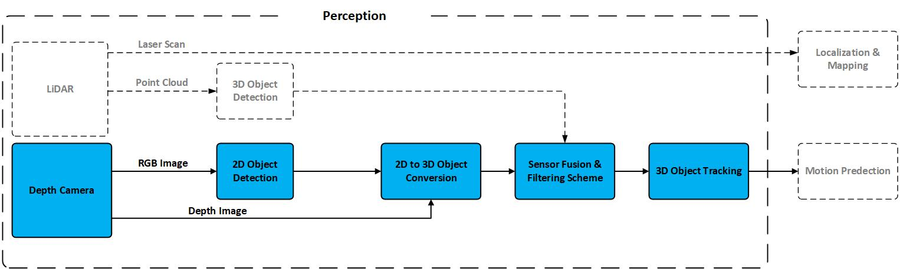

# Real-time 360° 3D detection and tracking for Mobile Robot

## Welcome to the AMR Perception repository! 

Real-time multi-modal multi-pedestrian detection and tracking framework.
### Overview
The main goal of this repository is to provide a clean, and easy to integrate inference pipeline for 2D (and 3D) detection and tracking. 
Our proposed framework is depicted in fig.1 using  five RGB-D cameras.


*Fig.1. A schematic the perception framework. Blocks with dashed border will be implemented in a future version*

This framework uses a 2D object detector that processes the RGB images from five RGB cameras and outputs 2D bounding boxes.
We employed the state-of-the-art [YOLOv7]('https://github.com/WongKinYiu/yolov7') network, as our
2D object detector. YOLOv7 is the powerful object detection algorithm and is perfect for fast real-time applications.

 
*Real-Time 2D detection*

The pipeline not only detects but also tracks the location (and velocity) of persons. However, RGB images do not contain depth information, so we use the depth image to translate these 2D bounding boxes to 3D.
Obtaining accurate depth information is essential in order to translate 2D object detections into 3D. We utilize a standard feature of the realsense-d455 RGB-D cameras that aligns the depth images with their corresponding RGB images. This alignment allows us to directly extract the region of interest (RoI) in the depth image by examining the bounding boxes provided by the 2D object detector

### Mount Hardware : 
5X intel realsense d455 
1X lidar velodyne VLP-16
1 X  3.1 USB Hub 5 ports 

 
*Fig.2. A LiDAR and Cameras mount*

### Sensor Calibration:
In this version the sensor calibration was made manually. 

## Ready to Hack!

### Installation
Simply install this repository with pip (or your preferred python package manager).
```bash
pip install -e .
```

### Quick Start

Make sure you have all 5 realsense cameras connected and their id's are set correctly in `scripts/tudelft_amr.py`. Additionally make sure you have sourced your ROS environment with access to `jsk_recognition_msgs`, and depending on which onnxruntime `execution_provider` you have chosen, make sure the corresponding drivers are install (cuda, tensorrt, openvino, etc.). 

Finally simply execute the script.
```bash
cd amr_perception/scripts
python tudelft_amr.py
```

## Video 

https://youtu.be/kFF_nrtYIOM


